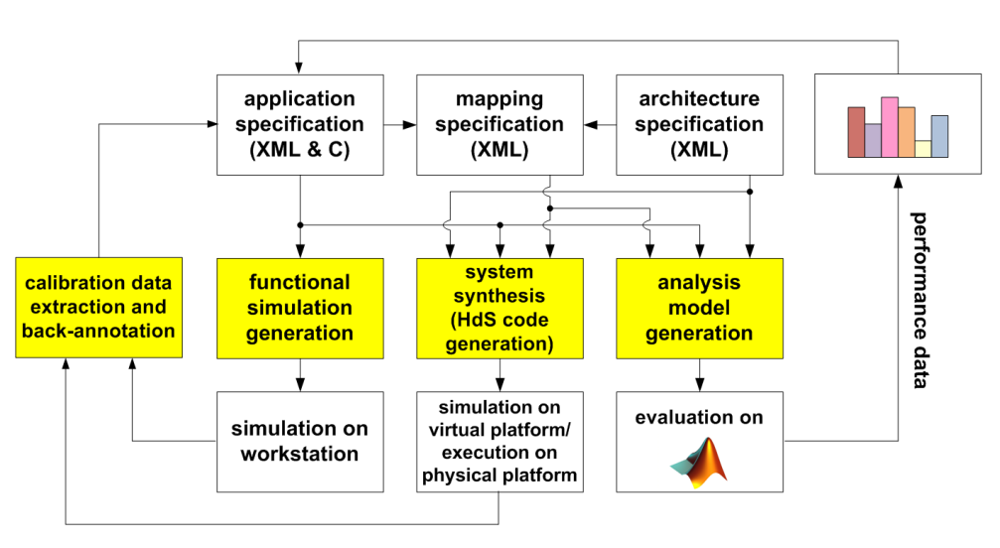
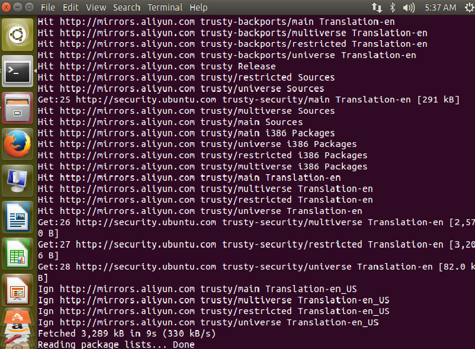
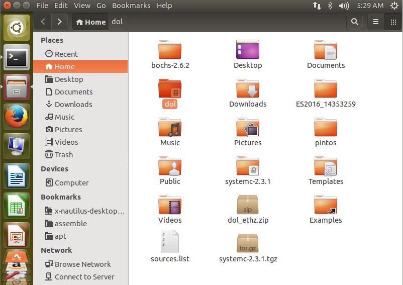
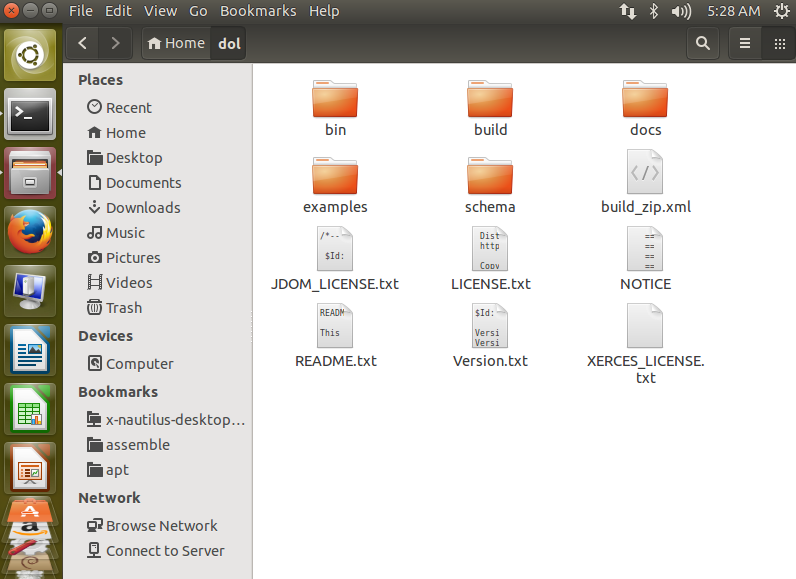
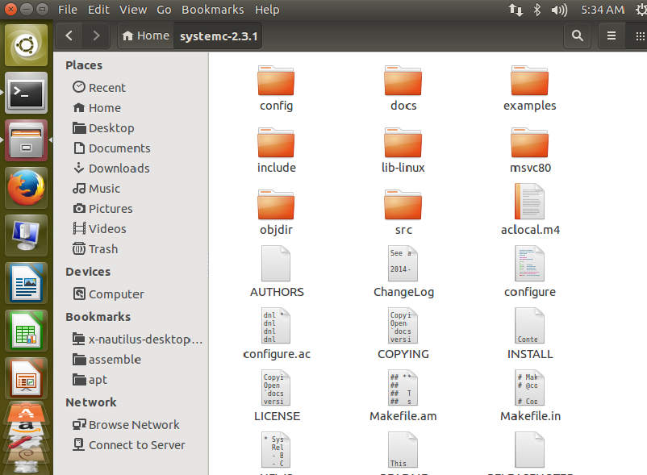
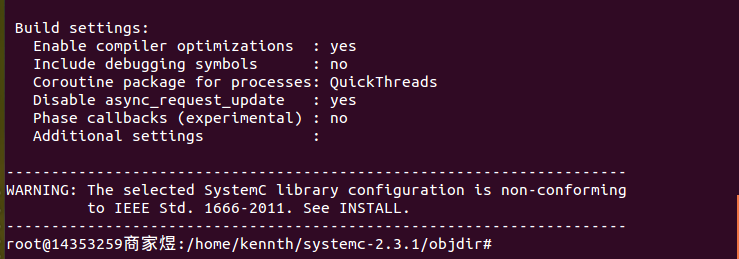
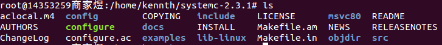
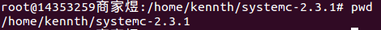
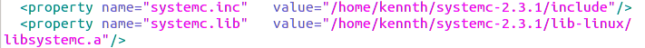
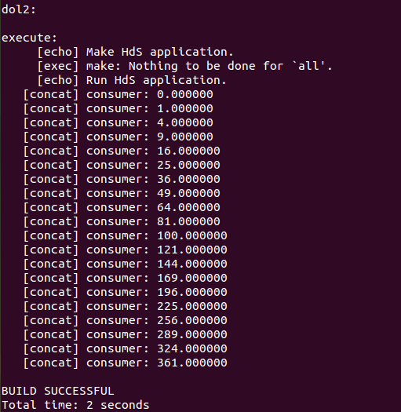

# DOL配置实验

## Make 工具介绍
* 在Linux和Ubuntu环境中，make工具主要被用来进行工程编译和程序。
* Makefile文件：告诉make以何种方式编译源代码和链接程序。
* make通过比较对应文件（规则的目标和依赖）的最后修改时间，来决定哪些文件需要进行更新。

## Ant 工具介绍 
* Ant是一种基于Java的build工具。
* Ant用Java的类来扩展。
* Ant本身就是这样一个流程脚本引擎，用于自动化调用程序完成项目的编译，打包，测试等。

## Ant的优点
* 跨平台性。Ant是纯java语言编写的，所以具有很好的跨平台性。
* 操作简单。Ant是由一个内置任务和可选任务组成的。Ant运行时需要一个XML文件（构建文件）
* 容易维护和书写，结构清晰。
* Ant可以集成到开发环境中。

# DOL配置步骤
### 1. 安装必要的环境
1. 在Ubuntu界面下键入`control+alt+T`打开终端
2. `$ sudo apt-get update` 获取更新   
         
 
    看到如上图所示的界面时，表示成功，否则需要进行换源处理，换源的过程可以参考[Ubuntu换源](http://www.linuxidc.com/Linux/2014-04/100476.htm)。 如果还是update失败可以参考[ubuntu apt-get update失败解决方法](http://blog.sina.com.cn/s/blog_afeac1330101bm2c.html)
3. `$ sudo apt-get install ant` 安装ant
4. `$ sudo apt-get install openjdk-7-jdk` 安装openjdk
4. `$ sudo apt-get install unzip` 安装unzip包
### 2. 下载文件
1. `sudo wget http://www.accellera.org/images/downloads/standards/systemc/systemc-2.3.1.tgz` 从网上下载systemc-2.3.1.tgz安装包到默认目录
2. `sudo wget http://www.tik.ee.ethz.ch/~shapes/downloads/dol_ethz.zip` 从网上下载dol_ethz.zip安装包到默认目录
### 3. 解压文件
1. `$ mkdir dol`   
新建dol的文件夹，此处我新建到了根目录下    
   
    
2. `$ unzip dol_ethz.zip -d dol`    
将dolethz.zip解压到dol文件夹中，解压后效果如下   

    
3. `tar-zxvf systemc-2.3.1.tgz`  
解压systemc，解压后在当前目录下得到systemc-2.3.1文件夹如下图
    
### 3. 编译systemc
1. 解压后进入**systemc-2.3.1**的目录下，在终端中键入  
`$ cd systemc-2.3.1`
2. 新建一个临时文件夹**objdir**  
`$ mkdir objdir`
3. 进入该文件夹**objdir**  
`$ cd objir`
4. 运行**configure**（能根据系统的环境设置一下参数，用于编译）   
`$ ../configure CXX=g++ -disable-async-updates`   
下图为运行configure之后的截图   
    
     
5. 运行代码`sudo make install`进行编译   
编译完后文件目录如下（*在终端中输入`$ cd .. $ ls`来进行查看当前目录下文件*）   
    
6. 通过`$ pwd`记录当前**systemc-2.3.1**的工作路径（这里的/home/kennth/systemc-2.3.1即表示我当前的工作路径）
       
### 3. 编译dol
1. 进入最开始生成的dol文件夹`$ cd ../dol`修改build_zip.xml文件，如果这里显示**权限不足**的话，可以通过已经root了的终端进行访问，即键入`$ gedit build_zip.xml`
2. 找到下面这段话，就是说上面编译的systemc位置在哪里（把YYY改成pwd的结果，**注意对于64位的系统，lib-linux64**)      
     >*property name="systemc.inc" value="YYY/include"*
     >*property name="systemc.lib" value="YYY/lib-linux/libsystemc.a"*  
   
    我的修改结果如下图所示：
    
3. 对刚才的文件进行编译，在终端中键入`$ ant -f build_zip.xml all` 若成功会显示**build successful**
4. 接着可以试试运行第一个例子，进入build/bin/main路径下
   `$ cd build/bin/main`     
   运行第一个例子   
   `$ ant -f runexample.xml -Dnumber=1`  
   成功结果如图所示：   
 
    
***
### 整个安装过程到这里就已经结束了，如果还有疑问的可以通过以下方式来联系我：
**邮箱**： *shangjy3@mail2.sysu.edu.cn*   
**QQ**: *540574928*   
欢迎各位有更好的安装方式或者安装过程中的bug跟我分享
