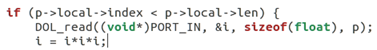
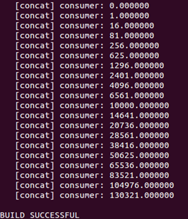
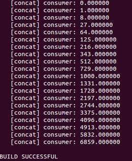

# DOL实例分析&编程
## 修改example1和example2的实现

### 任务
1. 修改example2，让3个squre模块变成两个，tips:修改xml的iterator
2. 修改example1，使其输出3次方数，tips：修改xml的iterator

### 实验步骤
##### 题目一
1. 首先通过文件管理器找到dol/example下的example1和example2文件夹
2. 根据实验题目，我们先进入example2文件夹中通过gedit方式打开xml文件
3. 根据研读代码，我们可以发现在该代码中控制迭代定义square模块和生成链接connection的位置如下图：    
	
4. 可以看到这里通过mxl语言设置了一个变量N，在后续的代码中表示迭代的次数。原文件中的N的值为3，表示创建了3个square模块并生成链接，这里，我们只需要将其改成初始值为2即可以达到题目的要求。
##### 题目二
1. 进入到example1文件夹中src文件夹中的square.c文件
2. 通过研读代码，我们可以发现代码的循环计算值的时候是得到一个平方的值，我们通过修改代码，多乘一次变量即可达到要求，修改后的代码如下图：     
              
     
##### 重新编译执行
1. 在终端下输入如下命令    
    `cd dol/bin/main`
2. 重新编译程序，在终端中键入如下命令     
    `sudo ant -f build_zip.xml all`
3. 进入主目录并且运行两个example文件   
	`cd build/bin/main`     
	`sudo ant -f runexample.xml -Dnumber=1'    
	`sudo ant -f runexample.xml -Dnumber=2`
4. 分别得到的结果如下图所示     
    **example1：**       

	
	**example2：**    

	
### 实验心得
通过本次实验课，了结了DOL的有关操作，实验课过程较为简单，课后将会继续上网查找相关资料进行了解